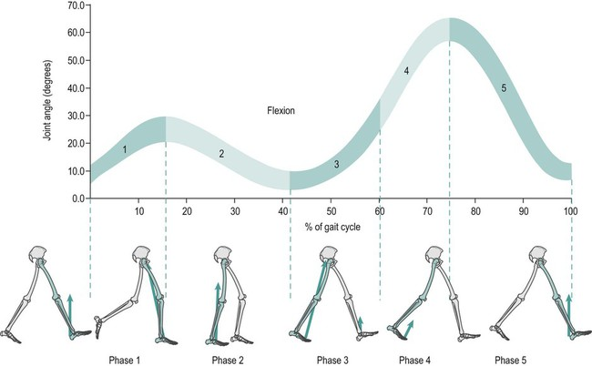

[](https://codespaces.new/jdtournier/cpp_assignment1_gait_analysis?quickstart=1)


# BEng Biomedical Engineering
### Object-Oriented Programming (5CCYB041) &ndash; Assessment 1


## Objective

To demonstrate proficiency in C++ by developing a program to perform a defined computational task.


# Assessment criteria

Your submission will be marked according to the following criteria:

**40%: Performance**
- Does the program compile?
- Does the program run successfully?
- Is the output correct?
- Does the program meet all requirements?
- Is the code for each individual aspect of the task correct?
- Are command-line arguments handled correctly?

**30%: Design**
- Is the code logically organised?
- Does it use appropriate C++ features?
- Does it make good use of control and data structures?
- Does it make good use of functions?
- Does the code include error checking and appropriate handling?

**30%: Maintainability**
- Is the code easily understandable?
- Is the code designed for modularity and re-use?
- Is the code organised across multiple files?
- Are functions and variables given interpretable names?
- Does the code follow established naming conventions?
- Does the code include comments where appropriate?
- Is code indentation correct throughout?


---

# Introduction 

In clinical gait analysis, the Knee Flexion Angle is the primary metric for assessing recovery after anterior cruciate ligament (ACL) surgery. A healthy gait cycle consists of a Stance Phase (foot on ground) and a Swing Phase (foot in air). During the Swing Phase, the knee must reach a peak flexion of at least 60° to 70° to clear the ground.

Patients recovering from anterior cruciate ligament (ACL) surgery are assessed during a treadmill test while wearing multiple inertial measurement units (IMU) that provide measurements of:
- the angle of the thigh and shin relative to the vertical axis
- the acceleration of the thigh
- the vertical acceleration of the shin

This information can be used to calculate the knee joint angle, detect individual gait cycles (steps), and assess if a patient’s range of motion (ROM) meets clinical recovery standards.




# Instructions 

Your task in this assessment is to write a C++ program to read IMU data from a file, perform a simple analysis of the data, and write a report of the analysis to file. 

Your program should perform the following main steps (these are described in more detail below):
1. Load the IMU data from a text file specified as a command-line argument.
2. Compute the knee flexion angle from the thigh and shin IMU recordings.
3. Detect gait cycles by identifying the heel strikes from the vertical acceleration signal using a threshold-based peak detection algorithm.
4. For each cycle:
   - compute the duration of the cycle (the interval between consecutive heel strikes),
   - record the maximum knee flexion angle. 
5. Compute the average peak knee flexion angle over all cycles, and check whether it exceeds the recovery threshold of 60°.
6. Write a summary of the analysis to an output text file (specified as a command-line argument).

# Program requirements

## Command-line interface 

Your program should accept at least 2 arguments: the filename containing the IMU recording, and the filename to use for the output file for the report of the analysis. 

If a third argument is provided, this should be interpreted as the minimum vertical acceleration to use as the threshold for heel strike detection (default: 1.5). 

If a fourth argument is provided, this should be interpreted as the minimum number of samples between heel strikes (default: 30 samples).


## Loading the input data 

You are provided with three data files (`pat1.txt`, `pat2.txt` & `pat3.txt`) containing synthetic IMU recordings. The data in each file is formatted as illustrated below:
```
THIGH_ANG SHIN_ANG THIGH_ACCEL VERT_ACCEL
4.72 -55.97 1.0 1.02
7.79 -53.31 1.03 1.04
8.42 -48.98 0.99 1.0
10.38 -45.9 0.99 1.02
11.92 -41.93 1.02 0.97
...
```
In more detail:
- the first line consists of the *labels* for each recording. There will be as many IMU recordings in the file as there are labels on this line.  
- subsequent lines consist of the recordings themselves, one for each label. The number of measurements on each line should match the number of labels on the first line. 

Your program should be capable of loading any file provided in this format. 

## Computing the knee flexion angle

Your program should compute the knee flexion angle as the difference between the thigh angle and the shin angle, for each time point:

$$ \theta_\textrm{knee} = \theta_\textrm{thigh} - \theta_\textrm{shin} $$


## Detecting heel strikes

Your program should detect heel strikes as the indices of the sample point where the vertical acceleration (`VERT_ACCEL`) exceeds a user-specified threshold (set to 1.5 by default). To prevent the possibility of multiple inclusion of the same heel strike, subsequent heel strikes should not be recorded until a user-specified minimum number of samples has elapsed since the last recorded heel strike (30 samples by default). 


## Computing per-cycle metrics

The heel strike indices provide markers between gait cycles. Using the output of the heel strike detection, your program should compute the duration of each gait cycle (in terms of the number of samples), and the peak (maximum) knee flexion angle during each gait cycle. 

## Computing the mean peak knee flexion and classifying the recovery status

Your program should compute the mean peak knee flexion, averaged over all gait cycles. Your program should then use the computed average peak knee flexion value to classify the recovery as follows:

| Avg peak knee flexion | Classification | Interpretation | 
|---|---|:---|
| <60° | poor | Poor recovery - consider follow-up | 
| >=60° | good | Good recovery |
 

## Writing the result to file

Your program should write its final report to the text file specified as the second argument on the command-line. This should include:
- the name of the file containing the IMU recordings
- the indices of the heel strikes
- the duration of the gait cycles (in terms of the number of samples)
- the peak knee flexion per gait cycle
- the average peak knee flexion over all gait cycles
- the recovery status: 'good' if average peak knee flexion is at least 60°, 'poor' otherwise.

An example report is shown below:
```
IMU file: pat1.txt
Heel strikes detected at sample index: 26 129 230 328 413 504 603 695
Cycle durations: 103 101 98 85 91 99 92
Peak knee flexion per cycle: 67.6 58.96 54.98 63.16 61.23 59.61 60.64
Average peak knee flexion: 60.8829
Recovery status: good
```

